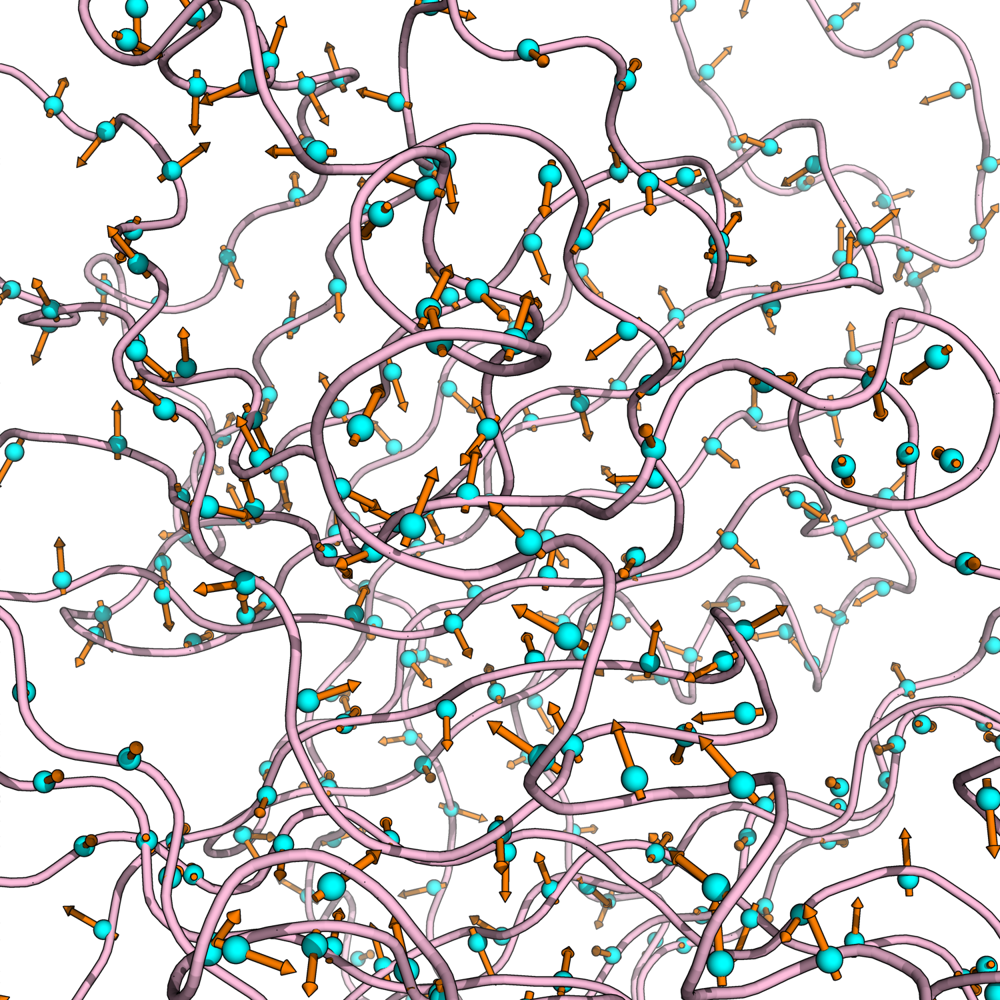

# NH Generalized Order Parameter

Calculates the generalized order parameter using the autocorrelation function of the NH vectors (requires well-fitted trajectory) or using the iRED procedure applied to the NH vectors. 

<p align="center">
  
</p>

## Autocorrelation

```
python nh_order.py protein.tpr protein.xtc "name N and not resname PRO and not resid 1" "name H and not resname PRO and not resid 1" ./results/
```

<p align="center">
  
</p>

## iRED

```
python nh_order.py protein.tpr protein.xtc "name N and not resname PRO and not resid 1" "name H and not resname PRO and not resid 1" ./results/ --mode 1
```

<p align="center">
  
</p>

## Order parameter

<p align="center">
  
</p>