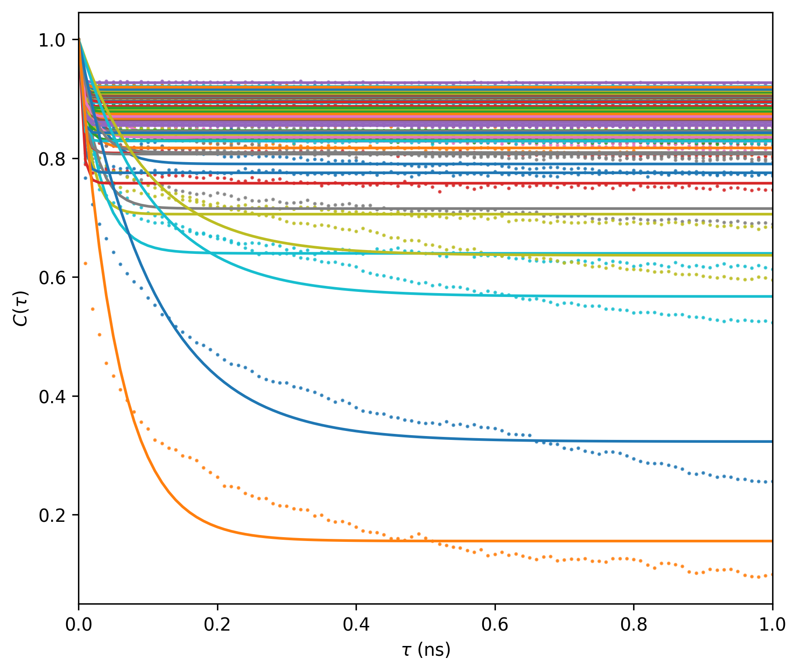
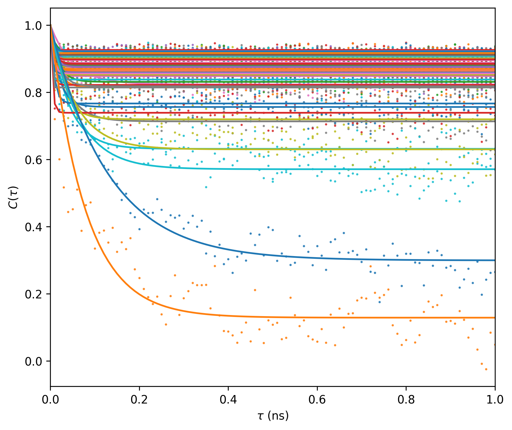
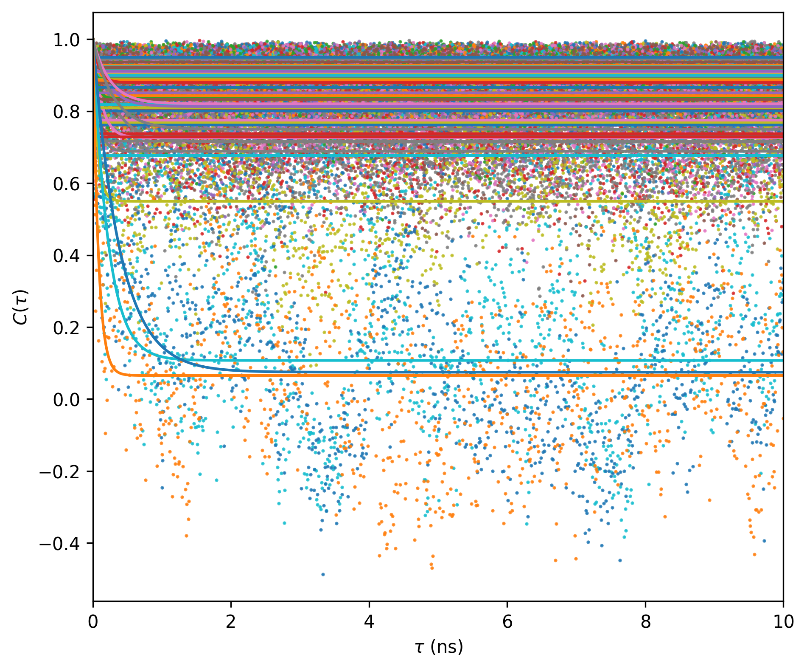
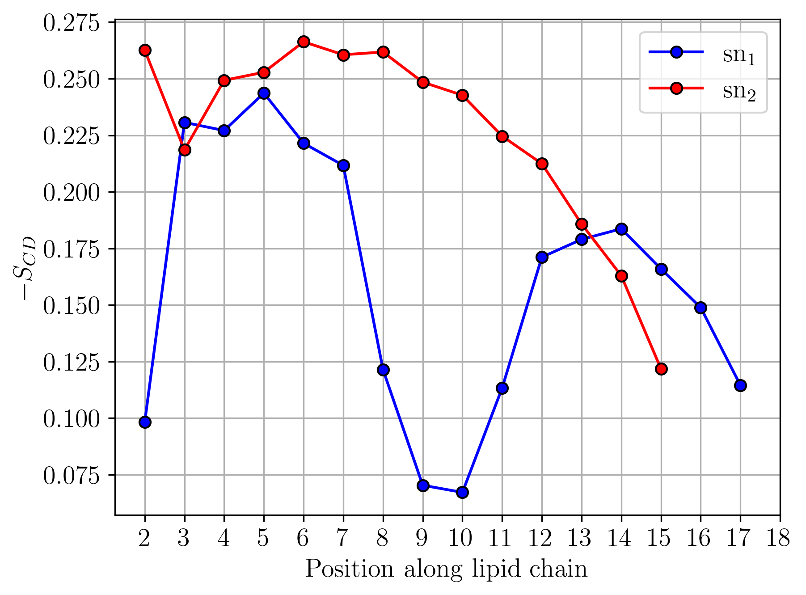

# NH Generalized Order Parameter

Calculates the generalized order parameter using the autocorrelation function of the NH vectors (requires well-fitted trajectory) or using the iRED procedure applied to the NH vectors. 

<p align="center">
  
</p>

## Autocorrelation

<p align="center">
  
</p>

```
python nh_order.py protein.tpr protein_nj_fit.xtc 5000 10000 "name N and not resname PRO and not resid 1" "name H and not resname PRO and not resid 1" 2 ./data/ --mode 0 --lenacf 100
```

<p align="center">
  
  
</p>

<p align="center">
  
</p>


```
python nh_order.py protein.tpr protein_nj_fit.xtc 5000 10000 "name N and not resname PRO and not resid 1" "name H and not resname PRO and not resid 1" 2 ./data/ --mode 1 --lenacf 100
```

<p align="center">
  
  
</p>

## iRED

```
python nh_order.py protein.tpr protein_nj_fit.xtc 5000 10000 "name N and not resname PRO and not resid 1" "name H and not resname PRO and not resid 1" 2 ./data/ --mode 2
```

<p align="center">
  
  
</p>

## Order parameter

<p align="center">
  
  
  
</p>

## Order parameter to any axis useful for membranes

```
python nh_order.py mem.tpr mem_mol.xtc 5000 10000 "name C3" "name H3" 2 ./data/ --mode 3 --vec 0 0 1
```

<p align="center">
  
</p>